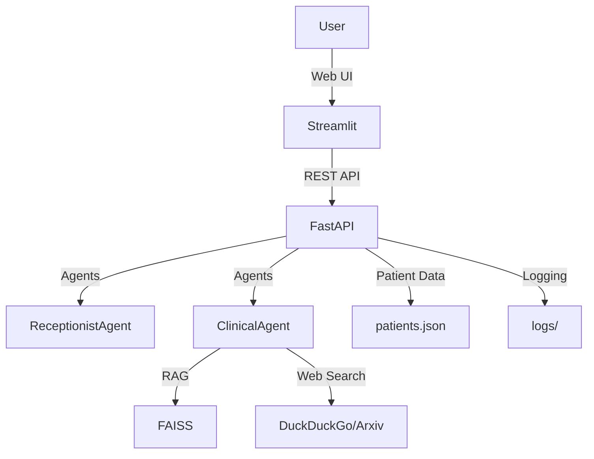

# Post-Discharge Medical AI Assistant

A multi-agent AI assistant for post-discharge patient care, featuring:
- **FastAPI** backend (REST API)
- **Streamlit** frontend (web chat UI)
- **LangGraph/LangChain** multi-agent framework (Receptionist & Clinical agents)
- **FAISS** vector database for RAG
- **Comprehensive logging** (logs/ directory)
- **Session-based conversation management**

---

## Features
- Receptionist agent (Maria): handles patient intake, admin, and triage
- Clinical agent (Dr. Sarah): answers medical queries using RAG and web search
- Agent handoff (Receptionist → Clinical and back)
- Patient data retrieval from JSON (25+ dummy reports)
- Medical reference via FAISS vector DB
- Web search fallback (DuckDuckGo, Arxiv)
- Logging to file and console
- Simple, modern web UI (Streamlit)
- API documented via FastAPI `/docs`

---

## Setup

### 1. Clone the repository
```bash
git clone <your-repo-url>
cd post_discharge_ai_assistant
```

### 2. Create and activate a virtual environment
```bash
python -m venv venv
# On Windows:
venv\Scripts\activate
# On Mac/Linux:
source venv/bin/activate
```

### 3. Install dependencies
```bash
pip install -r requirements.txt
```

### 4. Prepare data
- Ensure `data/patients.json` contains at least 25 dummy patient reports (see sample structure below).
- Ensure `data/nephro.txt` and `data/nephro_faiss.index` exist for RAG.

---

## Running the Application

### 1. Start the FastAPI backend
```bash
uvicorn backend_api:app --reload
```
- API docs: [http://localhost:8000/docs](http://localhost:8000/docs)
- Logs: see `logs/backend_*.log`

### 2. Start the Streamlit frontend
```bash
streamlit run app.py
```
- Web UI: [http://localhost:8501](http://localhost:8501)

---

## Architecture Overview



- **ReceptionistAgent**: Handles greetings, patient lookup, admin, and triage.
- **ClinicalAgent**: Handles medical queries, uses RAG and web search, provides citations.
- **Agent handoff**: Managed by backend and reflected in frontend UI.
- **Logging**: All backend activity is logged to `logs/`.

---

## Sample Patient Report Structure
```json
{
  "patient_name": "John Smith",
  "discharge_date": "2024-01-15",
  "primary_diagnosis": "Chronic Kidney Disease Stage 3",
  "medications": ["Lisinopril 10mg daily", "Furosemide 20mg twice daily"],
  "dietary_restrictions": "Low sodium (2g/day), fluid restriction (1.5L/day)",
  "follow_up": "Nephrology clinic in 2 weeks",
  "warning_signs": "Swelling, shortness of breath, decreased urine output",
  "discharge_instructions": "Monitor blood pressure daily, weigh yourself daily"
}
```

---

## Logging
- All backend logs are saved in the `logs/` directory with timestamps.
- Console shows warnings and errors.

---

## Medical Disclaimer
> **This is an AI assistant for educational purposes only. Always consult healthcare professionals for medical advice.**

---

## Development & Branching
- Use descriptive branch names, e.g. `feature/streamlit-fastapi-integration`, `feature/complete-web-poc`.
- PRs should include a summary of changes and testing steps.

---

## License
MIT (or your chosen license)
